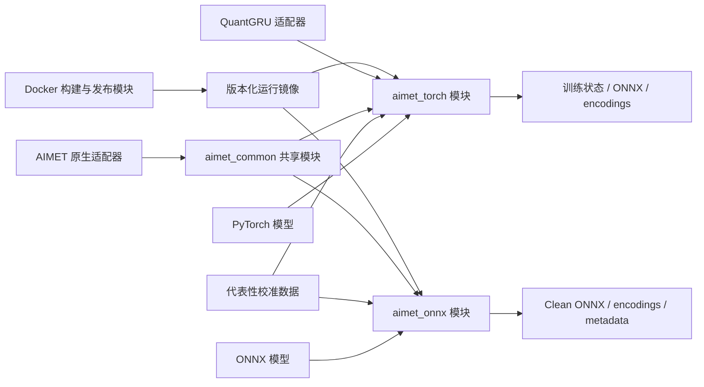
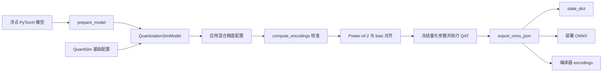
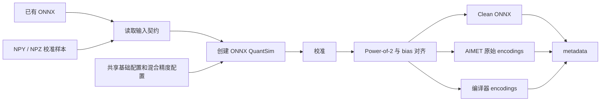
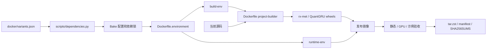

# rx-met 系统架构

本文档描述 rx-met 当前的系统结构、模块接口、量化数据流和发布架构。用户操作见
[用户使用指南](./User_guide.md)，配置字段见[量化配置](./Quant_config.md)，关键设计
理由见 [`adr/`](./adr/)。

## 1. 目标与范围

rx-met 面向 Linux x86_64 NVIDIA GPU 上的小模型量化，目标包括：

- 为 PyTorch 模型提供 PTQ、QAT、混合精度、Power-of-2 和 ONNX 导出流程。
- 为已有 ONNX 模型提供直接 PTQ 和编译器制品导出流程。
- 通过 QuantGRU 提供可校准、可训练的量化循环算子。
- 复用共享量化算法和配置，保持 PyTorch、ONNX 与部署制品的一致性。
- 通过版本化 Docker 镜像提供可复现的构建和运行环境。

正式发布目标是 Linux x86_64 NVIDIA GPU。CPU 模式用于原生库和 ONNX PTQ 的调试、
冒烟测试。大模型量化由其他项目负责。

## 2. 系统上下文

PyTorch 和 ONNX 是两条独立量化入口。`aimet_common` 提供共享算法，`native` 提供
C++/CUDA 实现，QuantGRU 在 PyTorch 模型接缝处替换原始 GRU。

## 3. 模块划分

| 模块 | 主要接口 | 隐藏的实现 |
| --- | --- | --- |
| `aimet_common` | QuantSim 公共定义、配置规则、Power-of-2 数值函数 | 框架无关的量化算法、图规则和原生库加载 |
| `aimet_torch` | `QuantizationSimModel`、混合精度工具、QAT 工具、`export_onnx_json()` | PyTorch 图准备、量化器管理、QuantGRU 协作和导出后处理 |
| `aimet_onnx` | ONNX QuantSim、`run_onnx_ptq()`、`CompilerEncodingConverter` | ONNX Runtime 会话、校准、Po2 对齐和节点级 encoding 映射 |
| `native` | 安装到 `aimet_common` 的 Python 扩展和 ONNX Runtime custom op | AIMET C++/CUDA 量化内核与 Python binding |
| `quant_gru` | `QuantGRU`、`GRU_config`、量化参数导入导出 | CUDA GRU、校准器、LUT、定点推理和反向传播 |
| 构建与发布 | `scripts/environment/*.sh`、`scripts/release/*.sh` | 依赖锁、环境镜像、项目 wheel、验收和归档 |

`aimet_onnx.rx_ptq` 是深模块：调用方提供 ONNX、配置和校准数据，模块内部完成 QuantSim
创建、校准、Power-of-2、bias 对齐、格式转换、覆盖率检查和制品导出。发布脚本也是
深模块：维护者选择 CUDA 变体，脚本内部解析环境、构建 wheel、组装镜像并执行验收。

## 4. PyTorch 量化流程

标准入口位于 [`examples/quick_start_kws.py`](../examples/quick_start_kws.py)。

流程接口遵循以下约束：

1. `prepare_model` 在 QuantSim 创建前完成模型图规范化。
2. 基础配置在创建 QuantSim 时加载，混合精度配置在校准前应用。
3. `compute_encodings` 使用代表性数据收集激活范围和参数范围。
4. Power-of-2 对齐修改实际量化器 scale，bias 可对齐到 `Sb = Sx * Sw`。
5. QAT 前冻结量化参数和 BatchNorm 状态。
6. 导出前将模型切换到 CPU 和 eval 模式。
7. 重载流程使用相同的模型准备参数、配置文件、默认位宽和量化方案。

QuantGRU 与其他模块共享同一次 `compute_encodings` 前向过程。QuantGRU 通过自己的
校准实现收集内部算子范围，并通过 `GRU_config` 接收位宽和量化粒度。

## 5. ONNX PTQ 流程

标准入口位于 [`examples/onnx_ptq_quick_start.py`](../examples/onnx_ptq_quick_start.py)，
主要实现位于 [`src/aimet_onnx/rx_ptq`](../src/aimet_onnx/rx_ptq/)。

`run_onnx_ptq()` 提供端到端接口。`CompilerEncodingConverter` 把已启用量化器映射到
节点输入、节点输出或参数条目，并输出 `schema_version: 3`。导出过程检查覆盖率和
孤立键。Clean ONNX 与编译器 encodings 作为同一组部署制品使用。

独立 ONNX 适配器的设计理由见
[ADR 0001](./adr/0001-direct-onnx-ptq-compiler-adapter.md)，encoding 与 Po2 决策见
[ADR 0002](./adr/0002-compiler-native-encodings-and-po2.md)。

## 6. QuantGRU 集成

QuantGRU 位于 [`operators/quant-gru`](../operators/quant-gru/)，通过
`quant_gru.QuantGRU` 提供 PyTorch 模块接口。当前替换接缝支持：

- `num_layers=1`。
- `dropout=0`。
- 单向和双向 GRU。
- 浮点、PTQ 和 QAT 前向路径。
- MinMax、SQNR 和 Percentile 校准。
- per-tensor、per-gate 和 per-channel 权重、偏置量化。

`apply_mixed_precision_bitwidth()` 识别 QuantGRU 实例，并把混合精度 JSON 中的
`GRU_config` 交给 QuantGRU。QuantGRU 的 Python 接口调用 PyTorch CUDA 扩展，扩展再
调用 C++/CUDA 实现。量化参数导出与整模型导出通过 `src/aimet_torch/rx_export`
汇合。

后续量化循环算子以 `operators/` 下的同级模块加入。公共实现会在多个算子形成稳定
共享接口后提取。

## 7. AIMET 原生适配器

[`native`](../native/) 保存 `aimet_common` 和 `aimet_onnx` 所需的 C++/CUDA 实现：

| 路径 | 职责 |
| --- | --- |
| `native/common` | 通用量化核心和 `_libpymo` binding |
| `native/onnx` | `libquant_info` 和 ONNX Runtime custom op |
| `native/third_party/onnxruntime` | 固定版本的 ONNX Runtime 头文件与许可证 |
| `native/tests` | CPU/CUDA Execution Provider 冒烟测试 |

原生构建向 `src/aimet_common` 安装 `_libpymo`、`libquant_info` 和
`libaimet_onnxrt_ops.so`。Python wheel 构建会检查这些文件的完整性。源码来源、ABI
和构建命令见 [AIMET ONNX 原生运行库](./AIMET_ONNX_NATIVE.md)。

## 8. 配置接口

| 配置 | 权威来源 | 消费模块 |
| --- | --- | --- |
| Python 兼容范围与包依赖 | `pyproject.toml` | Python 构建模块 |
| CUDA 变体与精确依赖 | `docker/variants.json` | 依赖工具和 Docker 构建模块 |
| QuantSim 基础配置 | `examples/config/mrnn_quantsim_config_custom_mixed_precision_v2.json` | PyTorch 与 ONNX QuantSim |
| 混合精度与 QuantGRU 配置 | `examples/config/quick_start_full_quant.json` | PyTorch 与 ONNX 混合精度适配器、QuantGRU |

`scripts/dependencies.py lock` 根据 `docker/variants.json` 生成
`docker/docker-bake.hcl` 和 `docker/requirements/*.lock`。生成文件由一致性测试校验。

配置匹配优先级是精确模块名、模块类型、通配符、默认配置。已注册但当前模型缺少的
量化模块类型会被跳过，未知类型会触发配置错误。

## 9. 构建与发布架构

环境镜像和项目镜像使用独立版本：

- 环境版本随 CUDA、Python、Torch、ONNX Runtime 或构建工具链变化。
- 项目版本随 AIMET Python、原生实现、QuantGRU、示例或产品行为变化。
- 项目构建复用匹配的 build-env 和 runtime-env。

`scripts/release/build.sh` 是发布构建入口，`scripts/release/verify_bundle.sh` 是镜像验收
入口。发布目录包含镜像归档、`image-manifest.json`、`SHA256SUMS` 和示例源码。
完整操作说明见 [Docker 构建与发布](./Release_packaging.md)。

## 10. 制品关系

| 制品 | 生产模块 | 主要用途 |
| --- | --- | --- |
| rx-met wheel | 项目 builder | 安装 `aimet_common`、`aimet_torch` 和 `aimet_onnx` |
| QuantGRU wheel | QuantGRU builder | 安装 `quant_gru` 和 CUDA 扩展 |
| build-env / runtime-env | 环境构建模块 | 固化编译环境与运行依赖 |
| `rx-met:<version>-<variant>` | 发布构建模块 | 用户运行环境 |
| PyTorch state dict | PyTorch 量化流程 | QAT 权重和量化器状态 |
| 部署 ONNX + encodings | PyTorch 导出流程 | PyTorch 模型部署 |
| Clean ONNX + compiler encodings | ONNX PTQ 流程 | 已有 ONNX 模型部署 |
| metadata | ONNX PTQ 流程 | 输入、校准、Po2、覆盖率和数值对比记录 |

模型文件和 encodings 按同一次导出结果配套使用。`image-manifest.json` 和
`SHA256SUMS` 提供镜像发布制品的身份与完整性信息。

## 11. 验证策略

| 验证层级 | 入口 | 覆盖内容 |
| --- | --- | --- |
| 依赖配置 | `tests/test_dependencies.py` | 版本范围、变体矩阵、Bake 配置和 lock 一致性 |
| AIMET 原生库 | `native/tests/smoke_onnx_runtime.py` | Python 扩展和 ONNX Runtime custom op |
| QuantGRU | `operators/quant-gru/tests/` | 浮点、量化、校准、训练和导出行为 |
| 发布镜像 | `scripts/release/verify_bundle.sh` | 包版本、GPU、AIMET 和 QuantGRU 冒烟流程 |
| KWS 示例 | `scripts/release/verify_kws_example.sh` | PyTorch PTQ、Po2、QAT、导出和重载 |
| ONNX PTQ 示例 | `scripts/release/verify_onnx_ptq_example.sh` | ONNX 校准、Po2、制品导出和重载 |

正式发布同时完成静态验收、目标 GPU 验收和真实数据示例验证。

## 12. 约束与风险

- 原生 AIMET 基线固定在 2.17.0。升级需要同时验证 Python 行为、原生 ABI、构建和
  encoding 格式。
- PyTorch 和 ONNX 流程共享配置与 Power-of-2 算法。共享实现集中在
  `aimet_common`，保持两条路径的行为一致。
- 编译器 encoding schema 是部署接口。schema 变化需要版本说明、兼容性策略和回归
  测试。
- 量化结果依赖模型、校准数据和配置。性能与精度结论需要记录完整复现条件。
- CUDA 变体声明需要在目标 GPU 和驱动环境验证，最低驱动兼容性需要在对应版本验收。
- 环境镜像与项目镜像的版本关系记录在 manifest 中，发布和回滚以完整镜像为单位。

## 13. 架构决策

- [ADR 0001：使用独立的 ONNX PTQ 编译器适配器](./adr/0001-direct-onnx-ptq-compiler-adapter.md)
- [ADR 0002：输出使用真实 Power-of-2 scale 的编译器 encodings](./adr/0002-compiler-native-encodings-and-po2.md)

新增模块或改变公开接口时，应同步更新本文档。非显然的设计取舍通过新 ADR 记录。
